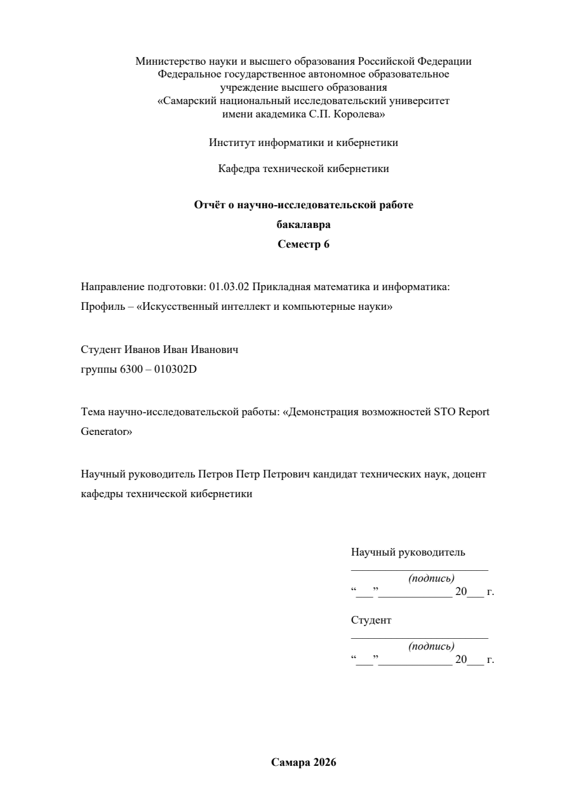
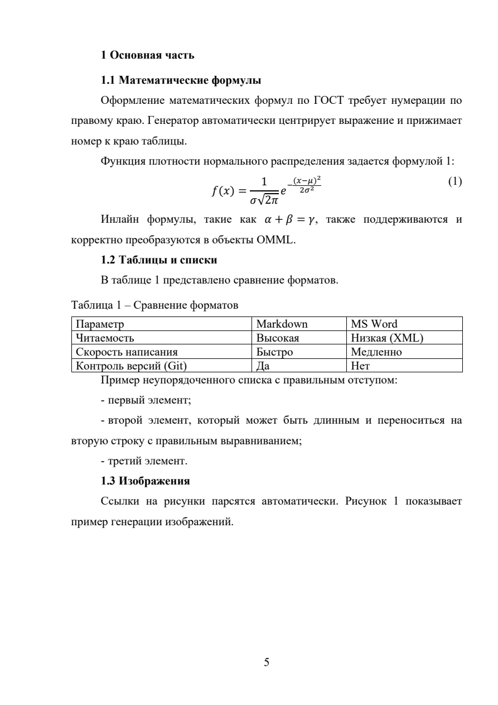

# STO Report Generator

<!-- cspell:ignore entrysubtype paralleltitle paralleledition editionresponsibility editionaddition numpages physicaldetails accompanyingmaterial seriesnumber bibliographicnote contenttype mediatype issn ismn -->

STO Report Generator собирает русскоязычные академические отчеты `.docx` из модульных Markdown-файлов. Базовый продукт -
переносимая сборка DOCX и структурная проверка OpenXML без Microsoft Word. Это удобно для WSL, Linux, macOS, Windows,
CI и агентных сценариев.

Word-путь остается отдельным режимом: он нужен, когда требуется авторитетная пагинация, обновление полей Word и экспорт
PDF через установленный Microsoft Word в Windows.





## Быстрый старт

Для установки CLI без клонирования репозитория соберите пакет один раз командой `npm pack` и установите полученный
`sto-report-generator-1.0.0.tgz` в отдельном проекте через `npm install <путь-к-tgz>` или `pnpm add <путь-к-tgz>`.
После установки запускайте `npx sto-report-generator new <slug> --profile lab`,
`npx sto-report-generator check <dir>` и `npx sto-report-generator generate <dir> --renderer portable --validate`.
Шаблоны отчёта и TypeScript runtime входят в npm-пакет; для необязательного Python post-build нужен установленный `uv`.
Публикация пакета в npm registry пока не выполнялась.

Для работы из checkout:

```bash
npm install
uv sync
npm run hooks:install
npm run new:report -- my_report --profile coursework --dir reports/my_report --title "Название темы"
npm run check:source -- reports/my_report
npm run generate:report -- reports/my_report --renderer portable --validate
```

Для комплексной проверки без Word:

```bash
npm run audit:report -- reports/my_report --renderer portable
```

Для финальной Word/PDF-проверки в Windows с установленным Microsoft Word:

```powershell
npm run audit:report -- reports/my_report --renderer word
```

Если DOCX уже собран в WSL и нужен только финальный пропуск через Microsoft Word на Windows-хосте:

```bash
npm run accept:word -- reports/my_report/build/my_report.docx
```

Команда `accept-word` вызывает Windows PowerShell и Word COM напрямую. Она не требует Windows Python и `pywin32`, не
запускает LibreOffice и по умолчанию сохраняет отдельные файлы
`*.accepted.docx`, `*.accepted.pdf`, `*.acceptance.json` рядом с исходным DOCX.

В WSL полный путь к PDF: сначала `generate --renderer portable --validate`, затем `accept-word` для полученного DOCX.
Word работает на Windows-хосте; временная копия документа размещается в Windows TEMP. Экспорт использует небольшой
C#-адаптер с явно типизированными аргументами COM. Итоговый статус `accepted` записывается только после проверки
завершения принадлежащих запуску процессов. При неудачной очистке каталог запроса сохраняется для восстановления.

## Что поддерживается

| Возможность                                                   | Переносимый режим | Word-режим | `accept-word` |
| ------------------------------------------------------------- | ----------------- | ---------- | ------------- |
| Создание структуры отчета                                     | Да                | Да         | Нет           |
| Preflight исходных Markdown-файлов                            | Да                | Да         | Нет           |
| Сборка `.docx` из Markdown, формул, таблиц, рисунков и BibTeX | Да                | Да         | Нет           |
| Проверка структуры DOCX через OpenXML                         | Да                | Да         | Нет           |
| Родные имена стилей из DOTM Самарского университета           | По умолчанию      | Да         | Проверяет     |
| Обновление полей Word и оглавления                            | Нет               | Да         | Да            |
| Авторитетная пагинация и PDF                                  | Нет               | Да         | Да            |

Переносимый режим означает кроссплатформенную OOXML-сборку и структурную проверку. Это не авторитетная пагинация.
Доказательство прохождения Word-приёмки - принятые `*.accepted.docx` и `*.accepted.pdf`, созданные целевым Microsoft Word, плюс
JSON-манифест `*.acceptance.json` с версией Word, числом страниц, хешами файлов, проверкой Times New Roman и проверкой
ожидаемых стилей. LibreOffice не является поддерживаемым финальным renderer.

Для необязательного быстрого PDF preview при установленном LibreOffice:

```sh
npx sto-report-generator preview build/report.docx --pdf build/report.preview.pdf
```

Путь к `LibreOffice` можно передать через `--soffice`. Preview работает на Windows, Linux и macOS, но его переносы строк и
страниц не заменяют приёмку в Word.

## Аудит соответствия и задачи реализации

[Аудит от 22 сентября 2026 года](docs/audits/2026-09-22-sto-coverage/README.md) содержит матрицу требований,
реестр стилей DOTM и численные сравнения. Наличие стиля, успешный XML-тест и визуальное соответствие Word
рассматриваются отдельно. Статус `accepted` подтверждает техническую Word-приёмку, обновление счётчиков реферата и
отсутствие их служебных меток в принятом DOCX. Он сам по себе не гарантирует соответствия всем пунктам СТО.

[Задачи устранения пробелов](docs/audits/2026-09-22-sto-coverage/backlog.md) заведены на [доске задач](kanban/tasks) в репозитории. Текущие статусы и доказательства приёмки указаны в карточках. Требования к присутствующим конструкциям
применяются ко всем профилям; состав НИР не становится обязательным для лабораторных.

Перед сборкой отчёта выполните [редакторскую проверку русского текста](docs/report-authoring.md#редакторский-проход-по-русскому-тексту)
в исходных Markdown-файлах. Навык `humanizer-ru` может помочь при явном запросе на редактуру; `check`, `generate` и CI
не меняют формулировки автоматически и не требуют установки навыка.

Профиль `lab` создаёт титульный лист без научного руководителя и строк подписей. Если известен преподаватель,
укажите `supervisorName` в `00_metadata.md`: титульный лист покажет строку «Проверил ...».
Профили `vkr-bachelor` и `vkr-master` создают разные титульные листы и отдельное задание;
`nir` сохраняет форму научного отчёта. Применимость внешних ГОСТ, образцы и границы проверки
описаны в [приёмке форм](docs/audits/2026-09-22-sto-coverage/gost-applicability-and-forms.md).

LibreOffice доступен как preview; [удалённый Microsoft renderer](docs/architecture/remote-microsoft-renderer.md) исследован, но не включён без согласованной передачи отчётов в облако. [GUI discovery](docs/architecture/gui-discovery.md) оставляет CLI основным интерфейсом до появления подтверждённого сценария работы без агента.

## Структура отчета

Обычный отчет хранится как набор отсортированных модулей:

```text
reports/my_report/
  00_metadata.md
  01_referat.md
  02_toc.md
  03_intro.md
  10_main.md
  90_conclusion.md
  91_sources.md
  references.bib
  images/
  report.config.json
```

`00_metadata.md` содержит данные титульного листа:

```markdown
---
department: 'Институт информатики и кибернетики'
subdepartment: 'Кафедра технической кибернетики'
reportType: 'Отчет по курсовой работе'
degree: 'по дисциплине "Название дисциплины"'
semester: 6
specialtyCode: '01.03.02'
specialtyName: 'Прикладная математика и информатика'
profileName: 'Искусственный интеллект и компьютерные науки'
studentName: 'Иванов Иван Иванович'
groupNumber: '6300 - 010302D'
topic: 'Название темы'
supervisorName: 'Петров Петр Петрович'
supervisorTitle: 'кандидат технических наук, доцент'
city: 'Самара'
year: 2026
bibliography: 'references.bib'
---
```

Пример содержательного модуля:

```text
\sto_structural_heading{ВВЕДЕНИЕ}

Цель работы - проверить сборку отчета по требованиям СТО.

Задачи работы:

\begin{sto_enum}
1. подготовить исходные Markdown-файлы;
2. выполнить preflight-проверки;
3. собрать DOCX и проверить стили.
\end{sto_enum}

Основные характеристики приведены в таблице 1.

Таблица 1 - Основные характеристики примера (@tab:example)
| Показатель | Значение |
|---|---:|
| Число разделов | 3 |

Иллюстрация показана на рисунке 1.


Рисунок 1 - Демонстрационный рисунок (@fig:example)
```

Макросы `sto_enum`, `sto_list` и `sto_bibliography` предназначены для исходников отчета. В документации они приводятся
только внутри fenced-примеров.

Библиографические отсылки к нумерованному затекстовому списку записываются как `[@key]` или, при цитировании
конкретных страниц, `[@key, с. 12–14]`. Генератор присваивает номер при первом упоминании и повторно использует его
для того же ключа. В списке появляются только процитированные записи. Это формат отсылок по ГОСТ Р 7.0.5-2008,
п. 7.4; внутритекстовые описания в круглых скобках и подстрочные ссылки пока не генерируются.
Для сетевого источника укажите `url` конкретной версии и `urldate` в формате `YYYY-MM-DD`; точность адреса относительно
цитируемой версии проверяет автор. Не придумывайте год публикации, место и издателя, если этих сведений нет на объекте.
Если запись `@misc` описывает сетевой ресурс без URL, задайте `entrysubtype = {online}`: проверка сообщит о недостающем адресе.
Путь `bibliography` может быть указан относительно каталога отчёта или рабочего каталога; если существуют два разных
файла по обоим вариантам, сборка останавливается до явного выбора файла.
Для печатной книги укажите известные выходные сведения; при их отсутствии проверьте сам источник перед тем, как
внести редакторское обозначение в квадратных скобках. Генератор не подставляет такие обозначения автоматически.

Дополнительные сведения BibTeX задаются явно: `paralleltitle` и `subtitle` для заглавия; `edition`, `paralleledition`,
`editionresponsibility`, `editionaddition` для издания; `extent` (вместо `pages`/`numpages`), `physicaldetails`,
`dimensions`, `accompanyingmaterial` для физической характеристики; `series` и `seriesnumber` для серии;
`bibliographicnote`, `isbn`, `issn`, `ismn`, `doi`, `contenttype` и `mediatype` для заключительных областей. Зависимые
поля без базового сведения и противоречивые пары вызывают ошибку. Эти поля покрывают типовые области описания, но
не заменяют сверку записи с самим источником и не образуют полный движок всех разновидностей ссылок ГОСТ Р 7.0.5.

Приложение задаётся одной структурной командой `\sto_appendix{А}{Расчётные данные}`. В основном тексте до приложения
используйте `\sto_appendix_ref{А}`: команда выводит «приложении А» и проверяет существование метки. Заголовок
приложения, локальная нумерация и запись в содержании формируются из одной метки и названия.
В реферате `{{APPENDICES}}` после Word-приёмки заменяется фактическим числом приложений (включая «0 приложений»);
новый шаблон уже содержит этот счётчик.

## Конфигурация

Основной пример настроен под переносимый режим:

```json
{
	"profile": "coursework",
	"renderer": "portable",
	"sourceDir": ".",
	"outputDocx": "build/my_report.docx",
	"document": {
		"requiredStructuralHeadings": [
			"РЕФЕРАТ",
			"СОДЕРЖАНИЕ",
			"ВВЕДЕНИЕ",
			"ЗАКЛЮЧЕНИЕ"
		],
		"optionalStructuralHeadings": [
			"ОПРЕДЕЛЕНИЯ, ОБОЗНАЧЕНИЯ И СОКРАЩЕНИЯ",
			"СПИСОК ИСПОЛЬЗОВАННЫХ ИСТОЧНИКОВ"
		],
		"requireReferat": true,
		"requireSources": "when-cited"
	},
	"preflight": {
		"strict": false,
		"softTextRules": "warning"
	},
	"postBuild": {
		"enabled": false,
		"exportPdf": false
	},
	"validate": {
		"enabled": true,
		"unpackDir": ".temp_docx"
	}
}
```

Word/PDF включается явно:

```json
{
	"renderer": "word",
	"postBuild": {
		"enabled": true,
		"exportPdf": true
	}
}
```

Финальная приемка уже созданного DOCX через Word:

```bash
npm run accept:word -- reports/my_report/build/my_report.docx \
  --accepted-docx reports/my_report/build/my_report.accepted.docx \
  --pdf reports/my_report/build/my_report.accepted.pdf \
  --manifest reports/my_report/build/my_report.acceptance.json
```

На WSL команда использует `powershell.exe` Windows-хоста и конвертирует пути через `wslpath`. На native Windows она
использует установленный Microsoft Word напрямую. На macOS и обычном Linux без Windows-хоста команда завершается рано с
инструкцией запустить приемку на WSL/Windows. Для `samara-template-2022` список ожидаемых отображаемых имен стилей
берется из TypeScript-конфигурации генератора и передается в PowerShell через UTF-8 JSON.

`accept-word` работает в режиме `auto` в текущей интерактивной Windows-сессии. Сначала он пробует скрытую фоновую
автоматизацию, чтобы не открывать Word перед пользователем. Если попытка завершается ошибкой или превышает жесткий
таймаут, лаунчер останавливает только записанные им PID, проверяет их завершение и повторяет приемку с видимым Word и
разрешенными диалогами. Диагностика лицензии через `vnextdiag.ps1` и `OSPP.VBS` записывается в manifest, но состояния
вроде `NOTIFICATIONS` сами по себе не блокируют запуск: авторитетным результатом считается успешное открытие DOCX,
обновление полей и оглавления, пагинация, сохранение отдельного DOCX, экспорт валидного PDF и стабильное число страниц
после повторного открытия.

Если Word сохраняет и пересчитывает страницы DOCX, но не завершает PDF-экспорт, команда остаётся неуспешной, однако сохраняет
частичный accepted DOCX и failure-manifest. В нём `exportedPdf=false`, указана стадия отказа, обе попытки, число страниц,
предупреждение OSPP и состояние принтера; частичный результат не выдаётся за авторитетный PASS.

Пагинация и PDF-экспорт выполняются с текущим системным принтером пользователя — тем же окружением разметки, которое
использует обычный Word. Команда не меняет default printer. Recovery-код остаётся только для безопасной очистки старого
незавершённого запуска, если тот успел записать printer-state до обновления этого workflow.

`accept-word` не заменяет `--renderer word`: он не выполняет Python/pywin32 post-build, не чинит формулы и не делает
format-repair из `scripts/sto_post_build/`. Это только финальная приемка уже сгенерированного DOCX в Microsoft Word.

Пути в `report.config.json` должны быть относительными к папке отчета. Локальные абсолютные пути, личные каталоги,
закрытые ссылки и идентификаторы пользователей не должны попадать в README, инвентарь источников или публичные fixtures.

## Стили Самарского шаблона

Генератор по умолчанию использует отображаемые имена из эталонного DOTM
`SHablon_oformlenija_VKR_2022_5_6.dotm`. Внутренние style ID (`Normal`, `StoHeading1`, `FigureCaption`, `TableText` и
другие) остаются стабильными, а в Word видны родные имена шаблона: `+Абзац с отступом 1-ой строки`,
`+ЗАГОЛОВОК по центру`, `+ЗаголРеферСодерж`, `+Заголовок 1 уровня`, `+№ - Название рисунка`,
`+№ - Название таблицы`, `+Текст в таблице`, `+Тит_Абзац по центру` и `+Оглавление 1..4`.

Для уровней 5–6 используются реальные имена DOTM `heading 5` и `heading 6`: пользовательских стилей
`+Заголовок 5 уровня` и `+Заголовок 6 уровня` в эталонном шаблоне нет.

Старые нейтральные отображаемые имена доступны только как явный режим совместимости:

```json
{
	"stylePreset": "default"
}
```

Переключатель меняет только отображаемые имена сопоставленных стилей. Тесты проверяют, что style ID и XML
форматирования не меняются.

## Проверки

```bash
npm run doctor
npm run check:source -- example
npm run audit:report -- example --renderer portable
npm run accept:word -- example/build/example.docx
npm run check:pack
npm run security:audit
npm run quality
```

`npm run doctor` показывает доступность переносимого режима, legacy Word-режима и Word acceptance для текущей платформы.
Он не должен печатать личные пути.

## Preview

Изображения в `docs/assets/example-page-1.png` и `docs/assets/example-page-5.png` получены из PDF на восемь страниц
после Word-приёмки текущего демонстрационного отчета `example/`. На странице 5 показана таблица с полями ячеек
по шаблону. В примере используются только демонстрационные имена и placeholder-содержание.

Воспроизводимый renderer-agnostic сценарий:

```bash
npm run audit:report -- example --renderer portable
```

После этого можно открыть полученный DOCX в выбранном локальном просмотрщике и экспортировать нужные страницы в PNG. Для
публичной документации используйте только демонстрационный отчет `example/`, а не страницы частных работ.

## Частые проблемы

| Симптом                                  | Что проверить                                                                                                                                                                                   |
| ---------------------------------------- | ----------------------------------------------------------------------------------------------------------------------------------------------------------------------------------------------- |
| `audit` пропускает post-build            | Проверьте `--renderer`: portable сознательно не запускает Word.                                                                                                                                 |
| Нужен PDF с точной пагинацией            | Для полной post-build обработки запустите `npm run audit:report -- reports/<slug> --renderer word` в Windows; для уже собранного DOCX запустите `npm run accept:word -- <docx>` из WSL/Windows. |
| Preflight отклоняет список               | Используйте `sto_list` или `sto_enum` в исходниках отчета.                                                                                                                                      |
| Preflight отклоняет `\begin{...}`        | Проверьте список окружений в `src/shared/config/sto-rules.json`.                                                                                                                                |
| Не найден рисунок                        | Укажите путь относительно папки отчета, например `images/chart.png`.                                                                                                                            |
| Цитата осталась как `[@key]`             | Добавьте запись в `references.bib` и проверьте поле `bibliography`.                                                                                                                             |
| Нужны старые нейтральные названия стилей | Укажите `stylePreset: "default"`; штатный режим уже использует имена из DOTM.                                                                                                                   |

## Документация

- `docs/report-authoring.md` - правила написания Markdown-отчетов.
- `docs/sto-rules-coverage.md` - покрытие правил СТО проверками.
- `docs/architecture/dotm-template-style-audit.md` - безопасно извлеченные параметры DOTM fixture.
- `docs/architecture/python-post-build.md` - архитектура Word post-build.
- `docs/source-inventory.md` - публичная инвентаризация источников и preview provenance.
- `tests/README.md` - структура тестов.
