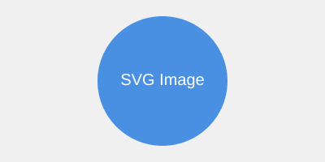

\sto_structural_heading{ВВЕДЕНИЕ}

Обычный абзац нужен для проверки первой строки, межстрочного интервала и выравнивания. Он достаточно длинный, чтобы перейти на вторую строку и выявить фактическую геометрию после открытия в Microsoft Word.

# Первый уровень

Абзац первого уровня повторяет одну и ту же последовательность слов в обоих документах.

## Второй уровень

Абзац второго уровня повторяет одну и ту же последовательность слов в обоих документах.

### Третий уровень

Абзац третьего уровня повторяет одну и ту же последовательность слов в обоих документах.

#### Четвёртый уровень

Абзац четвёртого уровня повторяет одну и ту же последовательность слов в обоих документах.

##### Пятый уровень

Абзац пятого уровня проверяет отдельно классифицированный стиль заголовка.

###### Шестой уровень

Абзац шестого уровня проверяет отдельно классифицированный стиль заголовка.

Источники нумеруются по первому использованию [@petrov2024]. Рисунок 1 показывает контрольную иллюстрацию.

Рисунок 1 – Контрольная иллюстрация (@fig:control)

Длинная таблица 1 содержит повторяемые строки и должна переходить на следующую страницу.

Таблица 1 – Контрольная длинная таблица (@tab:long)

| Номер | Описание                                            |
| :---- | :-------------------------------------------------- |
| 01    | Одинаковое содержание строки для проверки переноса. |
| 02    | Одинаковое содержание строки для проверки переноса. |
| 03    | Одинаковое содержание строки для проверки переноса. |
| 04    | Одинаковое содержание строки для проверки переноса. |
| 05    | Одинаковое содержание строки для проверки переноса. |
| 06    | Одинаковое содержание строки для проверки переноса. |
| 07    | Одинаковое содержание строки для проверки переноса. |
| 08    | Одинаковое содержание строки для проверки переноса. |
| 09    | Одинаковое содержание строки для проверки переноса. |
| 10    | Одинаковое содержание строки для проверки переноса. |
| 11    | Одинаковое содержание строки для проверки переноса. |
| 12    | Одинаковое содержание строки для проверки переноса. |
| 13    | Одинаковое содержание строки для проверки переноса. |
| 14    | Одинаковое содержание строки для проверки переноса. |
| 15    | Одинаковое содержание строки для проверки переноса. |
| 16    | Одинаковое содержание строки для проверки переноса. |
| 17    | Одинаковое содержание строки для проверки переноса. |
| 18    | Одинаковое содержание строки для проверки переноса. |
| 19    | Одинаковое содержание строки для проверки переноса. |
| 20    | Одинаковое содержание строки для проверки переноса. |
| 21    | Одинаковое содержание строки для проверки переноса. |
| 22    | Одинаковое содержание строки для проверки переноса. |
| 23    | Одинаковое содержание строки для проверки переноса. |
| 24    | Одинаковое содержание строки для проверки переноса. |
| 25    | Одинаковое содержание строки для проверки переноса. |
| 26    | Одинаковое содержание строки для проверки переноса. |
| 27    | Одинаковое содержание строки для проверки переноса. |
| 28    | Одинаковое содержание строки для проверки переноса. |
| 29    | Одинаковое содержание строки для проверки переноса. |
| 30    | Одинаковое содержание строки для проверки переноса. |

После таблицы стоит контрольный абзац для измерения интервала после неё.
